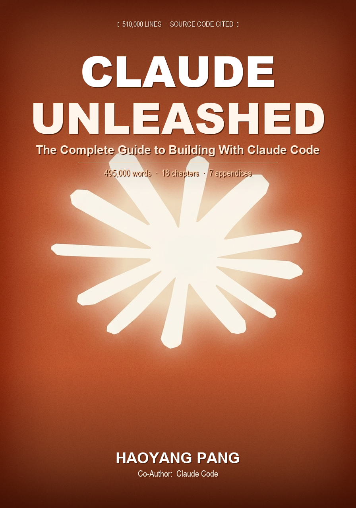

# Claude Unleashed
### The Complete Guide to Building With Claude Code

> *"We didn't set out to write a love letter. We set out to analyze source code."*

  

---

**495,000 words. 18 chapters. 7 appendices. Every claim cited from source code.**

On March 31, 2026, the full source code of Anthropic's Claude Code CLI was accidentally leaked via a `.map` file in their npm registry — 510,000 lines of unobfuscated TypeScript, downloadable for 72 hours before Anthropic closed the link.

This book exists because of that accident.

We read every line. We documented what we found. And we wrote the most comprehensive guide to Claude Code ever written — with exact file:line citations for every technical claim.

---

## Who This Book Is For

**Non-technical readers (Chapters 1–3)** — Teachers, managers, lawyers, doctors, anyone who wants to use Claude Code to build tools without writing code.

**Developers (Chapters 4–6)** — Rate limit strategies, settings deep dives, multi-agent workflows for shipping real products.

**AI builders (Chapters 7–10)** — Source code analysis, platform extensibility, what Anthropic is building next (it's in the feature flags).

---

## Table of Contents (Free Previews)

| Chapter | Words | Free Preview |
|---------|-------|-------------|
| [Preface: The Leak Story](preview/00_preface.md) | 5,063 | ~40% free |
| [Ch 1: What Is Claude Code, Really?](preview/01_what_is_claude_code.md) | 44,020 | First 2,000 words |
| [Ch 2: The Memory Garden](preview/02_the_memory_garden.md) | 45,041 | First 2,000 words |
| [Ch 3: Fifty Transformations](preview/03_fifty_transformations.md) | 50,184 | First 2,000 words |
| [Ch 4: The Rate Limit Survival Guide](preview/04_rate_limit_survival.md) | 40,038 | First 2,000 words |
| [Ch 5: The Settings That Change Everything](preview/05_settings_that_change_everything.md) | 45,069 | First 2,000 words |
| [Ch 6: Shipping Products With an AI Team](preview/06_shipping_with_an_ai_team.md) | 45,010 | First 2,000 words |
| [Ch 7: 510,000 Lines of Brilliance](preview/07_510k_lines_of_brilliance.md) | 60,037 | First 2,000 words |
| [Ch 8: Building on the Platform](preview/08_building_on_the_platform.md) | 39,716 | First 2,000 words |
| [Ch 9: When Everyone Can Build](preview/09_when_everyone_can_build.md) | 33,997 | First 2,000 words |
| [Ch 10: A Love Letter](preview/10_a_love_letter.md) | 25,015 | First 2,000 words |
| [Appendix A: settings.json Reference](preview/appendix_a_settings_json.md) | 15,023 | First 2,000 words |
| [Appendix B: Feature Flags Decoded](preview/appendix_b_feature_flags.md) | 10,058 | First 2,000 words |
| [Appendix C: All 18 Buddy Species](preview/appendix_c_buddy_species.md) | 8,063 | First 2,000 words |
| [Appendix D: CLAUDE.md Templates](preview/appendix_d_claude_md_templates.md) | 8,010 | First 2,000 words |
| [Appendix E: Architecture Map](preview/appendix_e_architecture_map.md) | 8,451 | First 2,000 words |
| [Appendix F: Cost Calculator](preview/appendix_f_cost_calculator.md) | 6,089 | First 2,000 words |
| [Appendix G: Hidden Commands Catalog](preview/appendix_g_hidden_commands.md) | 6,540 | First 2,000 words |

**Total: 495,425 words**

---

## Get the Full Book

**[$29.99 on Gumroad](https://phy041.gumroad.com/l/claude-unleashed)** — Full PDF + ePub, free updates forever.

Pay what you want (minimum $19.99).

---

## What Makes This Different

Every other Claude Code guide is based on documentation and experimentation.

This one is based on **source code**.

- `src/services/compact/autoCompact.ts:33` — the exact line where context compaction triggers
- `src/buddy/companion.ts` — `SALT = 'friend-2026-401'` — April Fool's Day hidden in a hash function
- `src/services/PromptSuggestion/speculation.ts` — the overlay filesystem that previews file edits before you approve them
- `src/utils/permissions/permissions.ts:473-1057` — the 3-phase, 8-source permission decision tree

When we say "here's how Claude Code works," we mean it literally.

---

## About the Source

The source code used for research in this book was the leaked `claude-code` npm package source map from March 31, 2026. It has since been patched by Anthropic. This book is an independent analysis and is not affiliated with Anthropic.

---

*Found a mistake? Open an issue. Want to contribute? PRs welcome for typos and factual corrections.*
